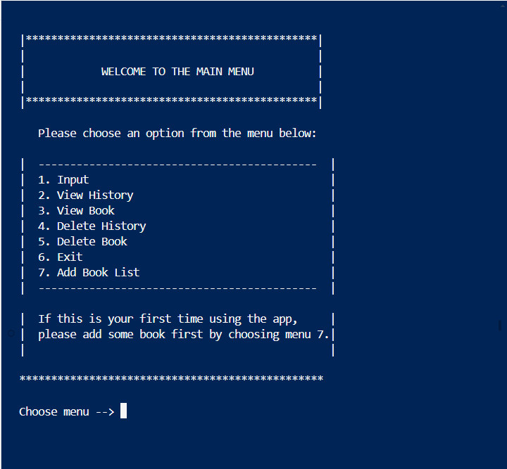
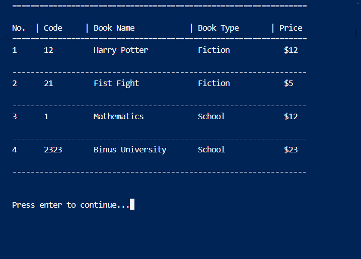
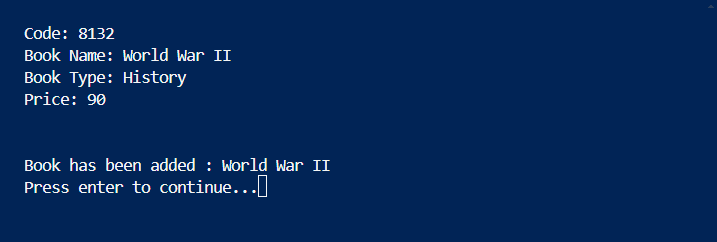

# Book Management System

## Overview

This Book Management System is a console-based application written in C that allows users to manage books in a library. The application provides functionalities to input, view, delete book records, and manage sales history.

## Features

- **Input Book Data**: Add new books to the database.
- **View Book Data**: Display all books in the database.
- **Delete Book Data**: Remove books from the database.
- **Input Sales History**: Record sold books.
- **View Sales History**: Display sold books history.
- **Delete Sales History**: Remove sales history records.

## File Structure

- `databuku.txt`: Stores book records.
- `history.txt`: Stores sales history.
- `main.c`: Contains the main application logic.
- `README.md`: This file.

## Example Usage

1. **Run the Program**: Execute the program in a console environment.
2. **Choose an Option**: From the menu, select an option (e.g., input new book data, view book data).
3. **Follow Prompts**: Provide necessary details when prompted by the program.
4. **Exit**: Select the exit option to close the program.

## Disclaimer

If this is your first time using the app, please add some books first by choosing menu number 7.

## Contribution

Feel free to contribute to this project by submitting issues or pull requests.

## License

This project is licensed under the MIT License - see the [LICENSE](LICENSE) file for details.
